# BestB4

                  (
                   )
              __..---..__
          ,-='  /  |  \  `=-.,
          :--..___________..--;
           \.,_____________,./

### Project Description

As our final project at Makers Academy - team BestB4 consisting of Eithel, Elsie, Jules, Mackenzie and Valeria had the challenge of changing the world in 8 days.  We came up with this - a website to help people waste less food by allowing users to easily give away food they won't use - or food that's about to expire - to other people in their local community. Here's our tasks broken down into user stories-

```
As a user
So I can find unwanted food
I can view a list of available food

As a user
So I can access my account
I can log in

As a user
So I can create an account
I can sign up

As a user
So I can give away food I won't use
I can list a food item

As a user
So people can see who I am
I can add my gravatar profile picture

As a user
So I can find food available in my local area
I can see a list of food in my area

As a user
So I can contact my fellow users
I want to be able to send them a message

As a user
So I can remove food from the application if it's been eaten/used
I want to be able to delete my own food items from the website
```

After having achieved our primary targets - we moved onto more ambitious ones - connecting our application to external API's. Firstly we used the Spoonacular API to allow users to see recipes based on what was in their own fridge as well as being given away by users in their local area-

```
As a user
So I can receive recipe ideas based on food items in my area
I can view a recipe suggestions
```

Once this goal had been attained we moved onto our final stretch goal - to allow users to see where their othe food was located. We did this using the google Maps API-

```
As a user
So I can see what items are available in my area
I can see items near my location on Google Maps
```

## Tech Stack

*After much deliberation at the start of the project we decided to use the MERN stack - Mongo, Express, React and Node in order to create our application. You're currently viewing our frontend and the rest of this readme will be focussed on how we used React and Redux to build frontend.*

## Technologies Used

* React
  * We built our app with React. This allowed us to create slick and good-looking front ends that would be easy to scale moving forward.
* Redux
  * One of biggest decisions we made in our project was to use Redux. Although the learning curve was sharp - it benefitted us hugely in the long run. Allowing us to use external API's with relative ease
* Axios
  * Axios allows us to connect with our API's. It was particularly useful when working with our own API as, if the user was logged in, [we always sent](https://github.com/mackacavs/bestB4-Front-End/blob/master/src/utils/setAuthToken.js) an 'x-auth-token' with the request that used for validation in our back-end
* React-Router-Dom
  * For routing we used react-router-dom. This allowed us to send the user to different parts of the application without the page reloading
* css
  * Instead of using a css framework like Bootstrap or Materialize, we created our own stylesheet to give us more creative freedom in our front-end
* Spoonacular API
  * The Spoonacular API allowed us to get recipes based on what was currently in our own fridge as well as in our local area. We took data stored in our Redux state to do this
* Google Maps API
  * Our Google Maps API told the user where they could find the food needed to make their recipes. We also used the node package 'google-map-react' to load our map
* UUID
  * Finally, UUID allowed us to give an ID to every alert we sent - making them easy to delete after 5 seconds

### Screenshots

#### Shots of the Application


The home page - we used the *background* css style component in order to create the effect you see above

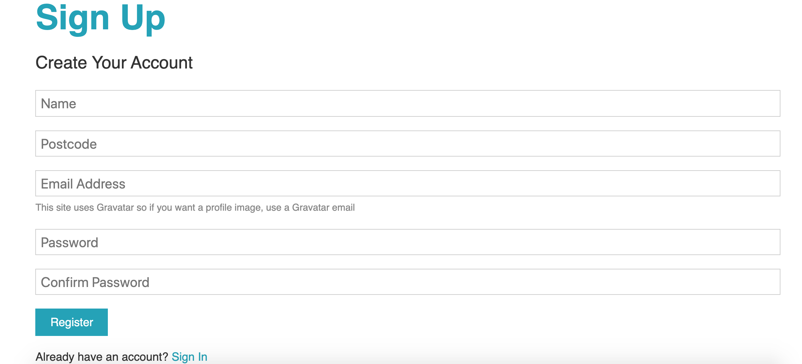

The sign-up page

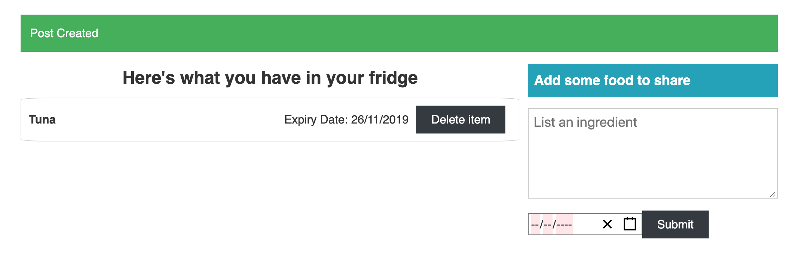

The user can view what he has in his fridge. Also note the alert at the top as when the user enters a food item an alert is sent.

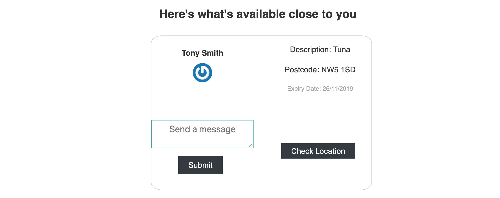

Here you can see what's available to the user locally. The user only sees items that have the same first 3 numbers of their postcodes

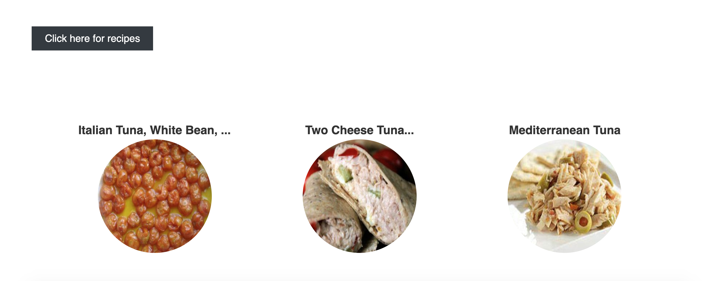

The Spoonacular API gives us back recipes based on what's in the users fridge as well as available locally

#### app.js file

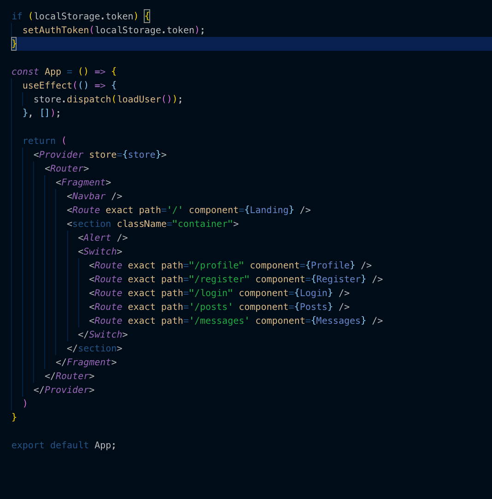

The heart of our frontend was based in our app.js file. Note how we run the *loadUser()* action everytime the application runs. This is because jwtoken is stateless  - so it has to be reloaded every time the application is updated

#### Redux path

Below you'll see how we use Redux to manage our state

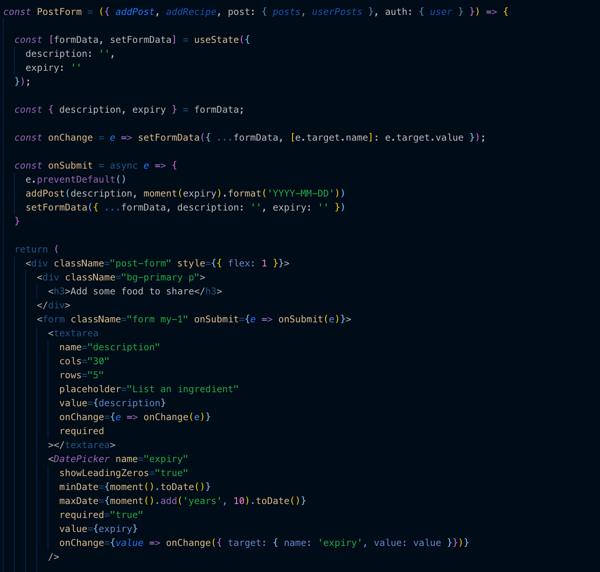

Firstly, the information that the user enters is saved locally in our component. When the user clicks the *submit* button the data is then sent to our *addPost* action along with an edited time the user has submitted.

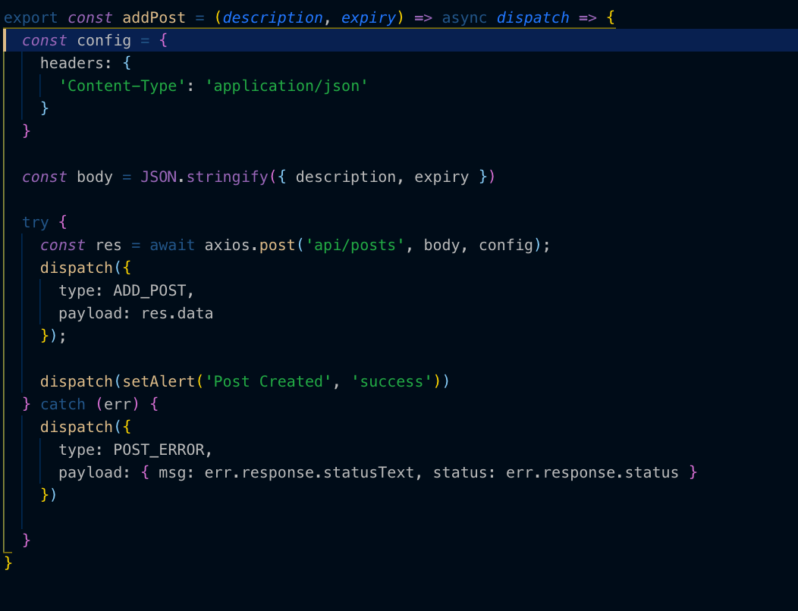

In our action file we firstly add our header to make sure our back-end knows what type of data to expect. *Remember, we're automatically adding the auth-token evey time the user tries to end data to our backend.* After the data has been successfully added, we call the reducer. This reducer recieves the data that we've got back from our backend. Finally our *setAlert* function is called - telling the user they've successfully added something to the database. 

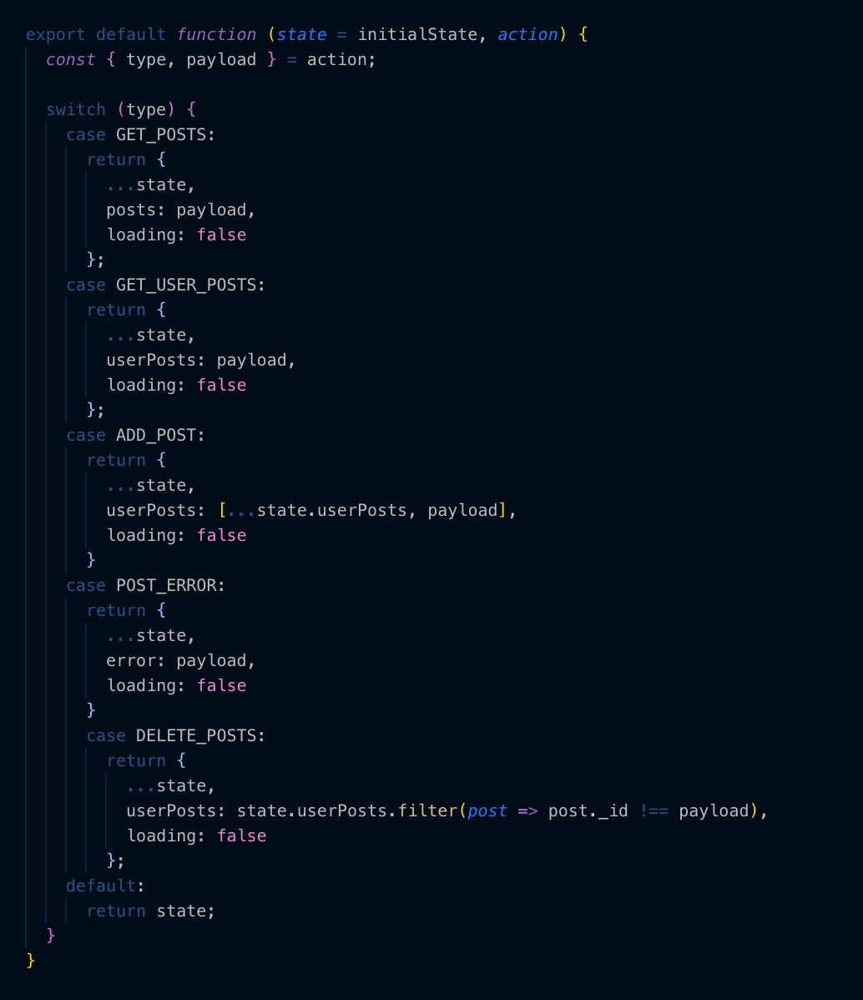

Our reducer is relatively simple. We add our payload - which in this case is the post we've just added (and got back from our backend API) - to our redux state.

#### Google Maps API

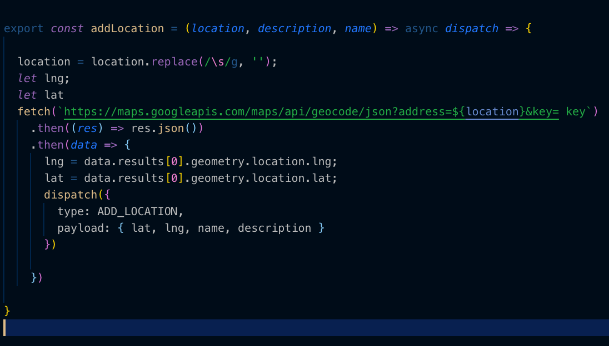

Here's a shot of the googleMaps action. We bring in the postcost from the redux state - every post has it's own postcose attached. From there we remove the space in the postcode and make the call to our google maps API. The latitude and logitude are returned as part of the API call and used to specify the location of the item of food. 

These are then added to the GoogleMaps component you can see below-

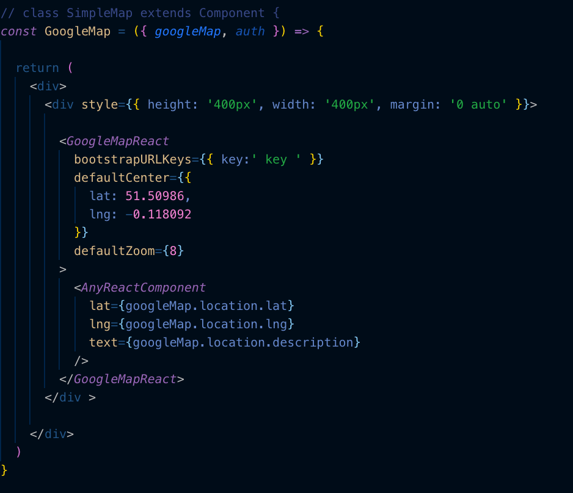

#### Spoonacular API

When the *Click here for recipes* button is clicked an action *addRecipe* is set off. This action is sent with all the users ingredients as well as all the ingredients in the database. From there, we firstly remove all ingredients that don't match the users postcode and we then add them to the listOfIngredients we're sending to the API. We then edit our url to satisfy the Spoonacular's API requirements.

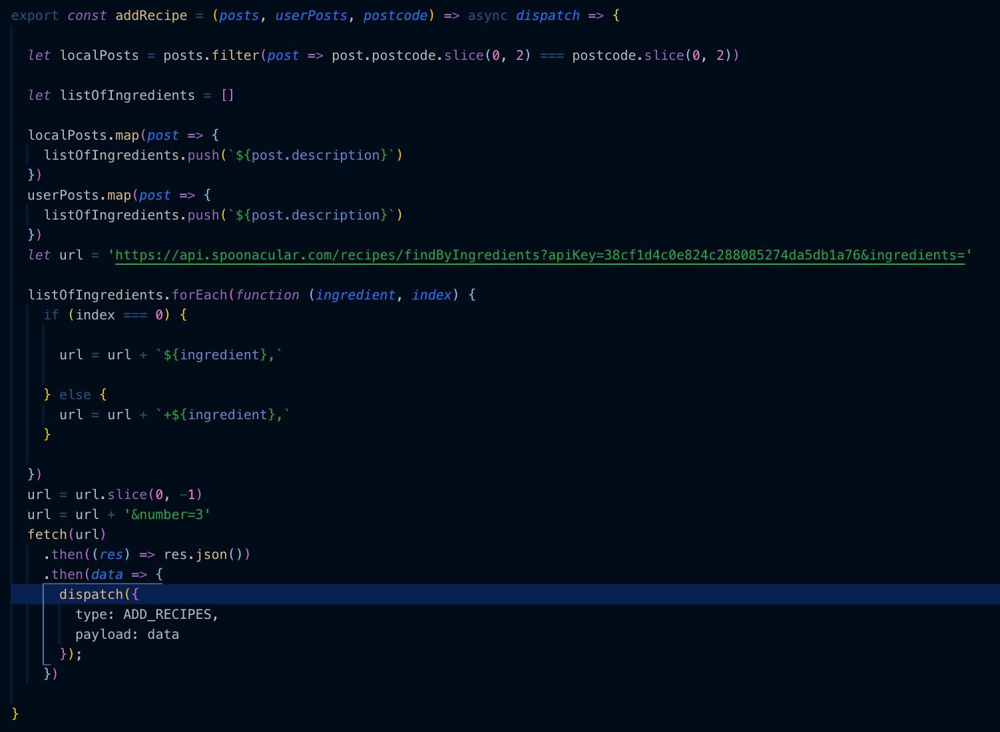

We then call our reducer sending a payload of the data we've got back from our API call. This can then be displayed on the screen.


Alternative architectures that could be used

Testing Challenges

How to load tests

Building and running the program locally

## Installation

* Git Clone the current repository into a local directory of your choice
* Run NPM Install in order to install the necassary modules to run the application
* Enter *node server.js* in order to run the backend server locally - this will be hosted on port 5000
